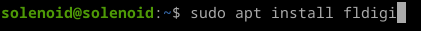
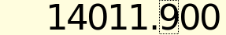
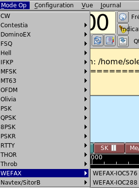
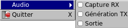
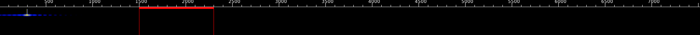
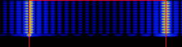
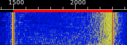
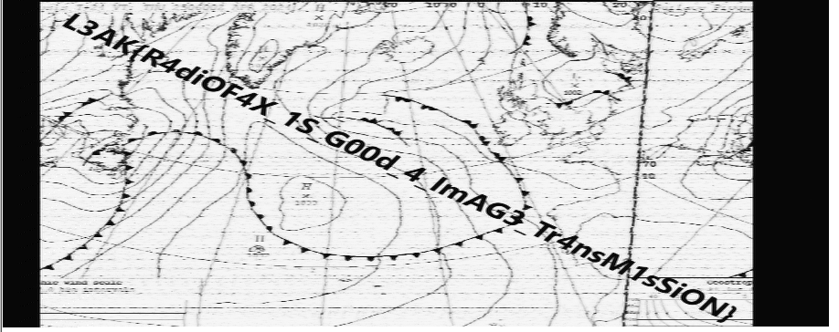

# Beneath the Surface
</img>

<h2>Greetings : Suvoni</h2> 

We will download the file "beneath_the_surface.wav" (Waveform Audio File Format) 
</img> 
Notice : 
- https://en.wikipedia.org/wiki/WAV 

With a size of 6.0 MB 
</img> 
Notice : 
- https://en.wikipedia.org/wiki/Megabyte

We will install a metadata extraction tool called "exiftool" 
</img> 

Here is the result : 
</img> 
important information : 
- Channels (mono) 
- Sample rate (8000 Hz) 
- Average Bytes per sec (16 000) 
- Software (fldigi-4.2.07) 
- Comment (WEFAX576 freq=14011.900 
- Duration 00:06:35 

Notice : 
- https://en.wikipedia.org/wiki/Monaural_sound 
- https://en.wikipedia.org/wiki/Sampling_(signal_processing)#Sampling_rate 
- https://en.wikipedia.org/wiki/Data-rate_units 
- https://sourceforge.net/projects/fldigi/files/fldigi/ 
- https://en.wikipedia.org/wiki/Radiofax 

We will install "fldigi" which is intended for radio amateurs. 
</img> 

We set the frequency of 14011.900 Hz. 
</img> 

We will put in the state "NONE". 
</img> 

We will also put the mode "WEFAX576", in our software, it is called "WEFAX-IOC576". 
Mode Op -> WEFAX -> WEFAX-IOC576 
</img> 

We will check the "Output" box and choose our file. 
</img> 

Optional: Enable or disable "Play in continuous loop" mode 
</img> 

We can see that the software is running. 
</img> 

The waterfall reacts correctly. 
</img> 
</img> 
</img> 
Notice : 
https://en.wikipedia.org/wiki/Waterfall_plot 

Here is the final result with the flag : L3AK{R4diOF4X_1S_G00d_4_ImAG3_Tr4nsM1sSiON} 
</img> 
