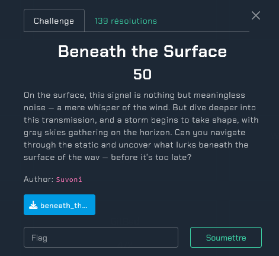
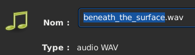
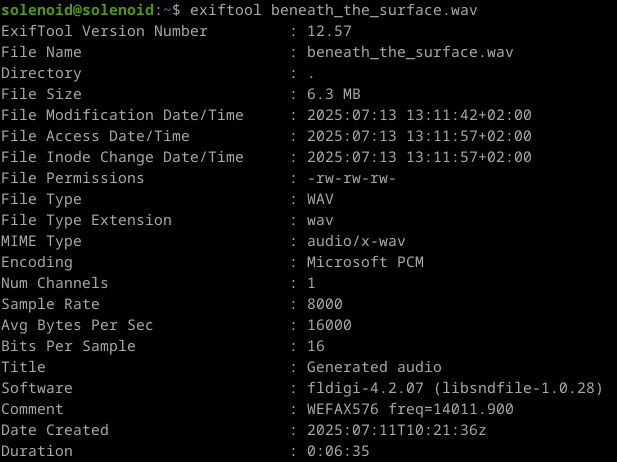

# Beneath the Surface
</img>

<h2>Greetings : Suvoni</h2> 

Nous allons télécharger le ficher "beneath_the_surface.wav" (Waveform Audio File Format) 
</img> 
Notice : 
- https://en.wikipedia.org/wiki/WAV 

Avec une taille de 6.0 Mio 
</img> 

Nous allons installer un outil d'extraction de métadonnées qui s'appelle "exiftool" 
</img> 

Voici le résultat : 
</img> 
Informations importantes : 
- Channels (mono)
- Sample rate (8000 Hz)
- Average Bytes per sec (16 000)
- Software (fldigi-4.2.07)
- Comment (WEFAX576 freq=14011.900
- Duration 00:06:35

