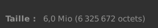
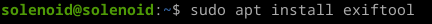
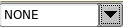

# Beneath the Surface
</img>

<h2>Greetings : Suvoni</h2> 

Nous allons télécharger le ficher "beneath_the_surface.wav" (Waveform Audio File Format) 
</img> 
Notice : 
- https://en.wikipedia.org/wiki/WAV 

Avec une taille de 6.0 Mio 
</img> 
Notice : 
- https://en.wikipedia.org/wiki/Megabyte

Nous allons installer un outil d'extraction de métadonnées qui s'appelle "exiftool" 
</img> 

Voici le résultat : 
</img> 
Informations importantes : 
- Channels (mono) 
- Sample rate (8000 Hz) 
- Average Bytes per sec (16 000) 
- Software (fldigi-4.2.07) 
- Comment (WEFAX576 freq=14011.900 
- Duration 00:06:35 

Notice : 
- https://en.wikipedia.org/wiki/Monaural_sound 
- https://en.wikipedia.org/wiki/Sampling_(signal_processing)#Sampling_rate 
- https://en.wikipedia.org/wiki/Data-rate_units 
- https://sourceforge.net/projects/fldigi/files/fldigi/ 
- https://en.wikipedia.org/wiki/Radiofax 

Nous allons installer "fldigi" qui est destiné pour les radioamateurs. 
</img> 

Nous réglons la fréquence de 14011.900 Hz. 
</img> 

Nous allons mettre à l'état "NONE". 
</img> 

Nous allons aussi mettre le mode "WEFAX576", dans notre logiciel, il s'appelle "WEFAX-IOC576". 
Mode Op -> WEFAX -> WEFAX-IOC576 
</img> 

Nous allons cocher la case "Sortie" et choisir notre fichier. 
</img> 

Facultatif : Activer ou non le mode "Jouer en bloucle continue" 
</img> 

Nous pouvons constater que le logiciel est en fonctionnement 
</img> 

Le waterfall réagit correctement 
</img> 
</img> 
</img> 

Voici le résultat final avec le flag : L3AK{R4diOF4X_1S_G00d_4_ImAG3_Tr4nsM1sSiON} 
</img> 
