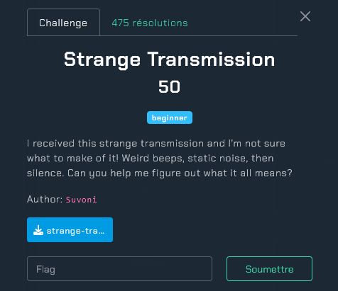
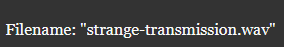
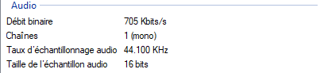

# Strange Transmission
</img>
<h2>Greetings : Suvoni</h2></br>
Nous allons télécharger le fichier ```strange-transmission.wav```</br>
</img></br>
Remarque :</br>
Nous avons un fichier ```.wav``` (Waveform Audio File Format) avec une taille de 27.088 Ko</br>
Sources :</br>
- https://en.wikipedia.org/wiki/WAV</br>
- https://en.wikipedia.org/wiki/Kilobyte</br>
</img></br>
Nous allons effectuer un clic droit sur le fichier -> propriétés -> détails</br>
Voici le résultat :</br>
</img></br>
- Débit binaire (705 Kbits/s)</br>
- Chaînes (mono)</br>
- Taux d'échantillonnage audio (44.100 Hz)</br>
- Taille de l'échantillon audio (16 bits)</br>
Sources :</br>
