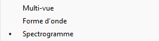
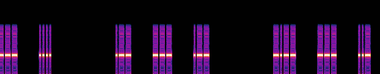

# Strange Transmission
</img>

<h2>Greetings : Suvoni</h2> 

Nous allons télécharger le fichier strange-transmission.wav 
</img> 
Remarque : 
Nous avons un fichier .wav (Waveform Audio File Format) avec une taille de 27.088 Ko 
</img> 

Sources : 
- https://en.wikipedia.org/wiki/WAV 
- https://en.wikipedia.org/wiki/Kilobyte 

Nous allons effectuer un clic droit sur le fichier -> propriétés -> détails 
Voici le résultat : 
</img> 
- Débit binaire (705 Kbits/s) 
- Chaînes (mono) 
- Taux d'échantillonnage audio (44.100 Hz) 
- Taille de l'échantillon audio (16 bits) 

Sources : 
- https://en.wikipedia.org/wiki/Bit_rate 
- https://en.wikipedia.org/wiki/Monaural_sound 
- https://en.wikipedia.org/wiki/Sampling_(signal_processing)#Sampling_rate 

Avec une durée de 5 minutes et 14 secondes 
</img> 

Nous avons télécharger et installer le logiciel qui s'appelle "Audacity" permettant de faire du traitement de signal. 

On va donc ouvrir notre fichier avec ce logiciel en cochant la case "Spectrogramme". 
</img> 

Voici le résultat : 
</img> 
Remarque : nous sommes en présence d'un codage morse 
</img> 
Remarque : suivi d'une suite de caractères qui représente un flag "c4teg0ry_w3_h0p3_you_h4ve_fun!}" -> il manque une partie du flag 

Pour décoder le morse, nous allons prendre ce site https://morsecode.world/international/decoder/audio-decoder-adaptive.html 

</img> 
Nous allons upload le ficher puis faire play 

Voici le résultat : 
</img> 

la deuxième partie partie du flag : "l3ak{welc0m3_t0_th3_h4rdw4r3_rf_" 

On les assemble et voici le résultat final : l3ak{welc0m3_t0_th3_h4rdw4r3_rf_c4teg0ry_w3_h0p3_you_h4ve_fun!} 
