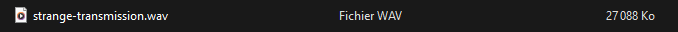
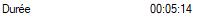
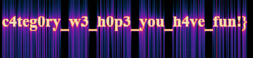
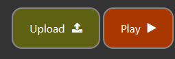
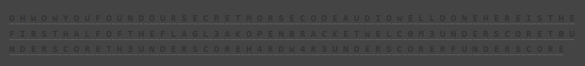

# Strange Transmission
</img>

<h2>Greetings : Suvoni</h2> 

We will download the file strange-transmission.wav 
</img> 
Notice : 
We have a .wav (Waveform Audio File Format) file with a size of 27.088 KB 
</img> 

Sources : 
- https://en.wikipedia.org/wiki/WAV 
- https://en.wikipedia.org/wiki/Kilobyte 

We will right click on the file -> properties -> details 
Here is the result : 
</img> 
- Bitrate (705 kbps) 
- Channels (mono) 
- Audio sample rate (44,100 Hz) 
- Audio sample size (16 bits) 

Sources : 
- https://en.wikipedia.org/wiki/Bit_rate 
- https://en.wikipedia.org/wiki/Monaural_sound 
- https://en.wikipedia.org/wiki/Sampling_(signal_processing)#Sampling_rate 

With a duration of 5 minutes and 14 seconds 
</img> 

We downloaded and installed the software called "Audacity" which allows us to do signal processing. 

We will therefore open our file with this software by checking the "Spectrogram" box. 
</img> 

Here is the result : 
</img> 
Notice : we are in the presence of Morse coding 
</img> 
Notice : followed by a sequence of characters that represents a flag "c4teg0ry_w3_h0p3_you_h4ve_fun!}" -> part of the flag is missing 

To decode Morse, we will take this site : https://morsecode.world/international/decoder/audio-decoder-adaptive.html 

</img> 
We will upload the file and then play 

Here is the result : 
</img> 

the second part of the flag : "l3ak{welc0m3_t0_th3_h4rdw4r3_rf_" 

We put them together and here is the final result : l3ak{welc0m3_t0_th3_h4rdw4r3_rf_c4teg0ry_w3_h0p3_you_h4ve_fun!} 
